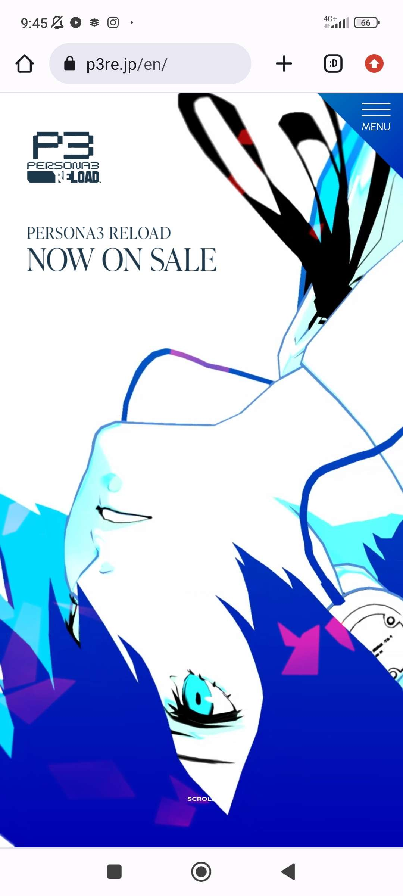
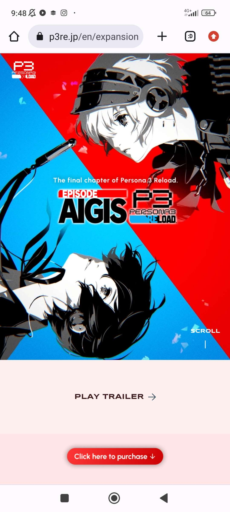

# Procesverslag
Markdown is een simpele manier om HTML te schrijven.  
Markdown cheat cheet: [Hulp bij het schrijven van Markdown](https://github.com/adam-p/markdown-here/wiki/Markdown-Cheatsheet).

Nb. De standaardstructuur en de spartaanse opmaak van de README.md zijn helemaal prima. Het gaat om de inhoud van je procesverslag. Besteedt de tijd voor pracht en praal aan je website.

Nb. Door *open* toe te voegen aan een *details* element kun je deze standaard open zetten. Fijn om dat steeds voor de relevante stuk(ken) te doen.

## Jij

  
uitwerken voor kick-off werkgroep

  ### Auteur:
  Luka Spelberg

  #### Je startniveau:
  Rood 

  #### Je focus:
  Surface plane
 

## Je website

  
uitwerken voor kick-off werkgroep

  ### Je opdracht:
  https://p3re.jp/en/

  #### Screenshot(s) van de eerste pagina (small screen): 
  persona 3 reload home page 
  
  

  #### Screenshot(s) van de tweede pagina (small screen):
  persona 3 reload expansion pass informatie page

  
 

## Toegankelijkheidstest 1/2 (week 1)

  
uitwerken na test in 2e werkgroep

  ### Bevindingen
  Lijst met je bevindingen die in de test naar voren kwamen:

  Bij de test van de verschillende toegankelijkheden viel me op dat het heel moeilijk is oplossingen ervoor te verzinnen. Bijvoorbeeld bij de spasm machine is het echt heel lastig je hand te gebruiken, maar zou ik ook niet weten wat een website ertegen kan doen. Verder gebruikte ik ook dingen zoals de brillen die je beperkingen geven bij je ogen, en bij deze is het gewoon belangrijk dat je website een goed lettertype gebruikt met constrant met de achtergrond zodat het goed te lezen blijft.

Later bij de screenreader test kwam ik erachter dat mijn website niet goed gebouwd is voor screenreaders. Hij Skipte veel text omdat ze bijvoorbeeld in een svg stonden. Als je de website ook opent krijg je eerst een pop up te zien, maar deze is niet zichtbaar voor de screenreader. Dus als je niet kan zien heb je geen idee hoe je hem kan verwijderen. 

## Breakdownschets (week 1)

  
uitwerken na afloop 3e werkgroep

  ### de hele pagina: 
  

  ### dynamisch deel (bijv menu): 
  

  ### wellicht nog een dynamisch deel (bijv filter): 
  

## Voortgang 1 (week 2)

  
uitwerken voor 1e voortgang

  ### Stand van zaken
  de html ging wel goed, de css was nog lastig

  ### Agenda voor meeting
  samen met je groepje opstellen

  | Luka           | Rens               | Reuben       | student 4        |
  | ---            | de nav bar         | ---          | ---              |
  | weer inkomen   | zichtig maken      | weer inkomen | en dan ik dat    |
  | in de regels   |                    | in flexbox   | dit wil ik zeker |
  | van html       |                    | ...          | ...              |

  ### Verslag van meeting
  hier na afloop snel de uitkomsten van de meeting vastleggen

  - html structuur veranderen
  - backdrop filter
  - figure article ipv div
  - ...

## Voortgang 2 (week 3)

  
uitwerken voor 2e voortgang

  ### Stand van zaken
  css gaat tot nu toe erg goed, moeite met selectoren en positioneren.

  ### Agenda voor meeting
  samen met je groepje opstellen

  | Luka           | Rens               | Reuben       |                  |
  | ---            | ---                | ---          | ---              |
  | dit bespreken  | en dit             | en ik dit    | en dan ik dat    |
  | en dat ook nog | dit als er tijd is | nog een punt | dit wil ik zeker |
  | ...            | ...                | ...          | ...              |

  ### Verslag van meeting
  hier na afloop snel de uitkomsten van de meeting vastleggen

  - punt 1
  - punt 2
  - nog een punt
- ...

## Toegankelijkheidstest 2/2 (week 4)

  
uitwerken na test in 9e werkgroep

  ### Bevindingen
  Lijst met je bevindingen die in de test naar voren kwamen (geef ook aan wat er verbeterd is):

## Voortgang 3 (week 4)

  
uitwerken voor 3e voortgang

  ### Stand van zaken
  hier dit ging goed & dit was lastig (neem ook screenshots op van delen van je website en code)

  ### Agenda voor meeting
  samen met je groepje opstellen

  | student 1      | student 2          | student 3    | student 4        |
  | ---            | ---                | ---          | ---              |
  | dit bespreken  | en dit             | en ik dit    | en dan ik dat    |
  | en dat ook nog | dit als er tijd is | nog een punt | dit wil ik zeker |
  | ...            | ...                | ...          | ...              |

  ### Verslag van meeting
  hier na afloop snel de uitkomsten van de meeting vastleggen

  - punt 1
  - punt 2
  - nog een punt
  - ...

## Eindgesprek (week 5)

  
uitwerken voor eindgesprek

  ### Je uitkomst - karakteristiek screenshots:
  

  ### Dit ging goed/Heb ik geleerd: 
  Korte omschrijving met plaatjes

  

  ### Dit was lastig/Is niet gelukt:
  Korte omschrijving met plaatjes

  

## Bronnenlijst

  
continu bijhouden terwijl je werkt

  Nb. Wees specifiek ('css-tricks' als bron is bijv. niet specifiek genoeg). 
  Nb. ChatGpT en andere AI horen er ook bij.
  Nb. Vermeld de bronnen ook in je code.

  1. bron 1
  2. bron 2
  3. ...

